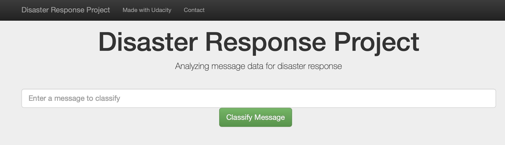
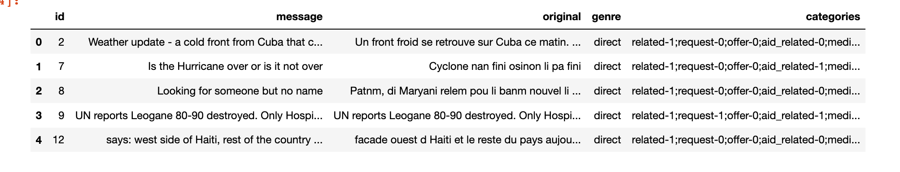
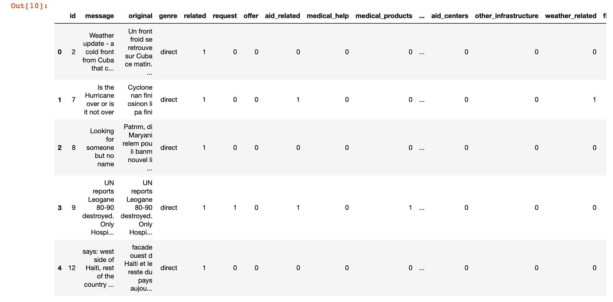
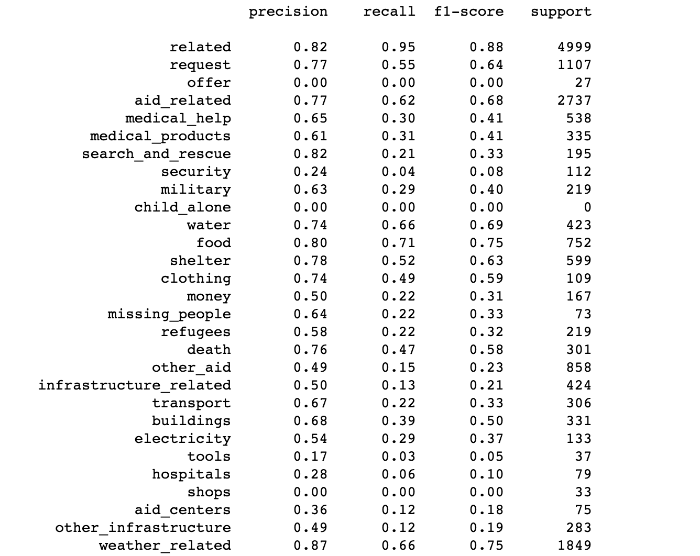
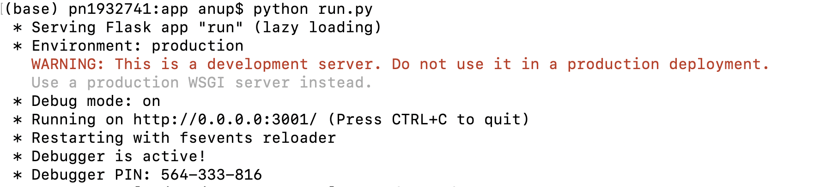
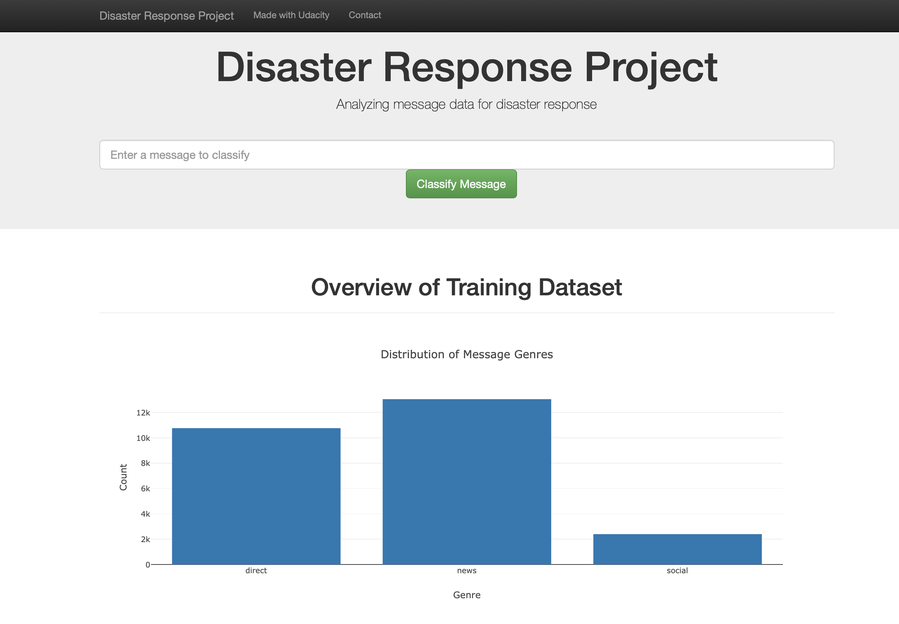
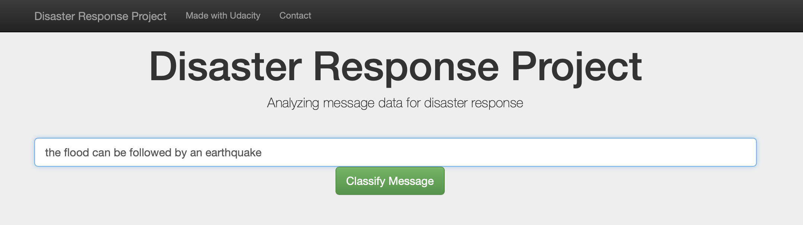
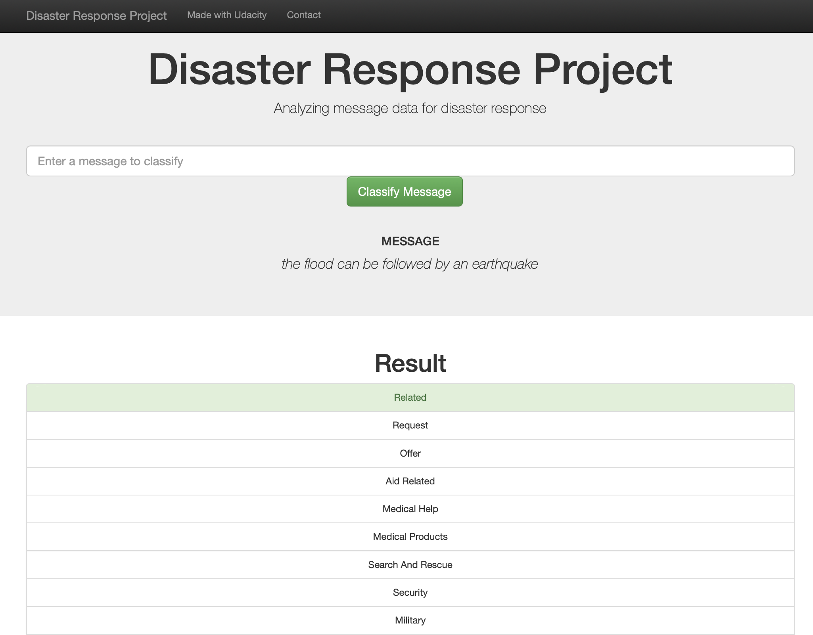
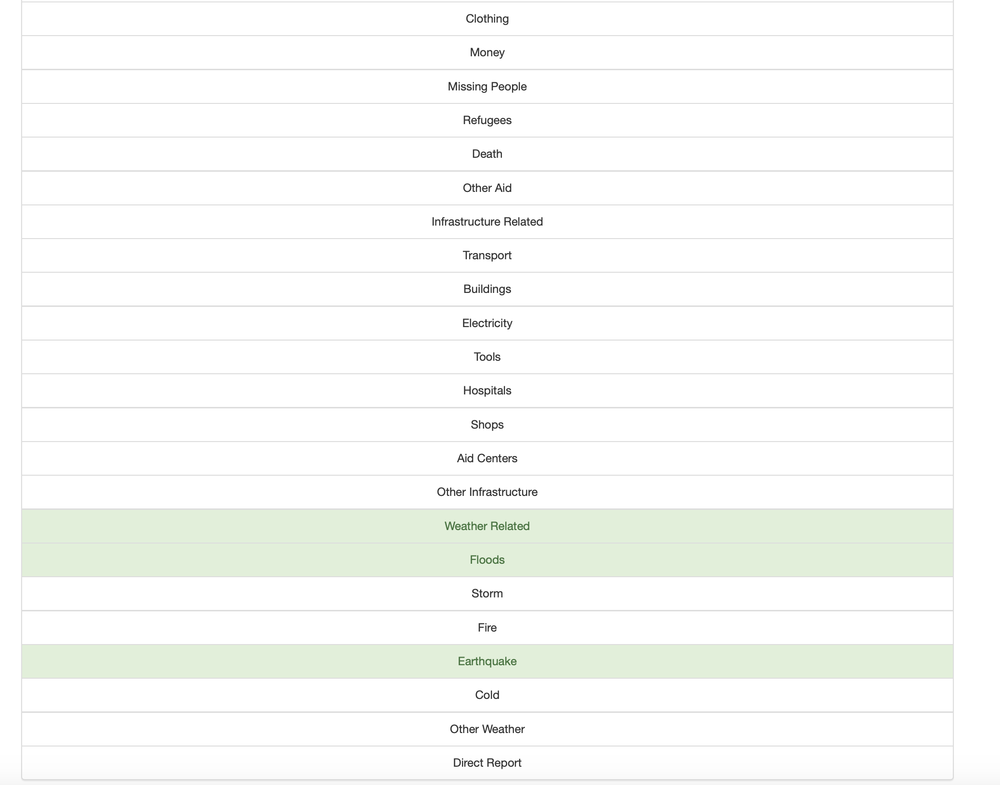
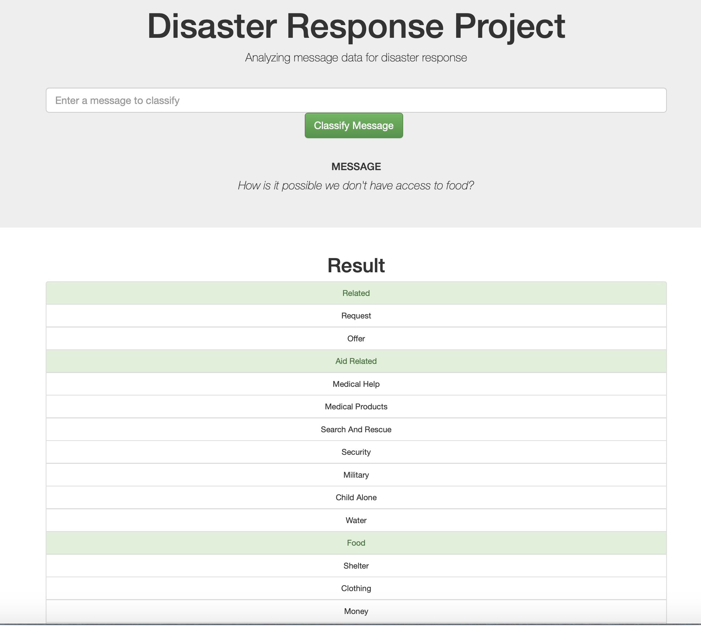

# Disaster-Response-Project

## Table of Contents

1. [Project Motivation](#project_motivation)
2. [Installation](#installation)
3. [Run](#run)
4. [File Descriptions](#file_descriptions)
5. [Results](#results) 
6. [License](#license)
7. [Acknowledgement](#acknowledgement)

## Project Motivation

This project analyses disaster data from [Figure Eight](https://appen.com/) to build a model for an API that calssifies disaster messages. It is a part of a Data Science Nanodegree program by Udacity. The data set contains real messages that were sent during disaster events. The project aims to create a Natural Language Processing(NLP) machine learning pipleine to categorize these events so that the messages can be sent to an appropriate disaster relief agency. The project includes a web app where an emergency worker can input a new message and get classsification results in several categories. The web app will also display visualizations of the data.

The project is has three major categories:

  1. Build an ETL pipeline; extract data from sources, clean the data and save them in a SQLite database.
  2. Build NLP machine learning (ML) pipleine to classify messages in several categories.
  3. Build a web app which can calssify the message using models in the real time.
  

## Installation  

  Requires Python 3+
  
  The repository can be cloned by: 
  
    git clone  https://github.com/ap439111/Disaster-Response-Project.git
    

## Run

     > cd Disaster-Response-Project
     
  To run the ETL pipeline:
  
      > python data/process_data.py data/messages.csv data/categories.csv data/disaster_response.db
      
  To run the ML pipeline:
  
      > python models/train_classifier.py data/disaster_response.db models/classifier.pkl
      
  To run the web app:
  
      > cd app
      > python run.py
      
  To display app, go to:
  
      http://0.0.0.0:3001/
     

## Files Descriptions

  There are three folders:
  
   1. data
        
        This folder contains following files:
        
          i.  ETL_Pipeline_Preparation.ipynb: ETL Pipeline preparation notebook
          ii. process_data.py: ETL pipleine (python script) to extract data and features, transform the data and load it in SQLite database
          iii. Data files: messages.csv and categories.csv
          iv. disaster_response.db: Cleanded SQLite database file
              
  2. model
  
        This folder contains following files:
        
        
          i.  ML_Pipeline_Preparation.ipynb: ML pipeline preparation notebook
          ii. train_classifier.py: ML pipeline to load the SQLite database, train the ML model and save the model as pickle file. 
          iii. classifier.pkl: Saved model
          
  3. app
  
        This folder contains following folder and files:
        
      
          i. templates: this folder contains two html files go.html and master.html to run the web app
          ii. run.py:  python script can be used to launch the Flask web app to classify disaster messages
          
  4. pics
  
        This folder contains screenshots of the main results.
          

## Results

The screenshots of main results are presented and describes in this section.

    1. Dataframe after merging the messages.csv and categories.csv data using ETL pipeline notebook. The data is uncleaned.
     

    2. Cleaned data frame from ETL pipeline notebook.
  
  
    3. Model performance for test data from ML pipeline notebook

    4. Lauch web app using the command: python run.py
       Leave the following screen open to launch the app by typing http://0.0.0.0:3001/ in the brower.

    5. Overview of different messages genre in training the set. Three messages genres are direct, news and social media.

    6. Input the query on the web app.

    7. Results for first query: "the flood can be followed by an earthquake". The message is classified into four categories:
       1) relevant 2) Weather Related 3) Floods 4) Earthquake

    8. Second query: "how is it possible we don't have access to food". This message is classified into follwoing categoreies:
       1) relevant 2)Air Related 3) Food

## License

## Acknowledgement
* [Udacity](https://www.udacity.com/) for providing an amazing Data Science Nanodegree Program
* [Figure Eight](https://www.figure-eight.com/) for providing the relevant dataset to train the model

